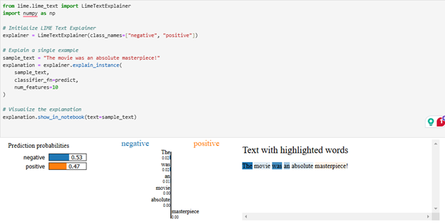

# BERT Sentiment Analysis Interpretation

This project demonstrates how to fine-tune a pre-trained BERT model on the IMDb movie review dataset for binary sentiment classification (positive or negative), with a focus on explainability using LIME (Local Interpretable Model-agnostic Explanations).

---

## 📌 Objective

To develop an interpretable and accurate sentiment analysis model using BERT, and explain its predictions at the word level using LIME. This enhances trust and transparency in natural language processing tasks.

---

## 🧠 Methodology

- **Dataset**: IMDb Movie Reviews Dataset (50,000 labeled reviews)
- **Model**: Fine-tuned pre-trained BERT model (`bert-base-uncased`)
- **Preprocessing**:
  - Lowercasing, removing special characters, HTML tags
  - Tokenization using BERT tokenizer
  - Padding/truncation to 256 tokens
  - Label encoding for sentiment (0 = Negative, 1 = Positive)
- **Modeling**:
  - BERT with added classification head
  - Fine-tuning on IMDb dataset
- **Interpretability**:
  - Used LIME to interpret individual predictions
  - Visualized which words contributed most to sentiment prediction

---

## 📊 Results

- The fine-tuned BERT model achieved strong sentiment classification accuracy.
- LIME successfully highlighted key contributing words to the sentiment predictions.
- Example:
  - Text: `"The movie was absolutely fantastic!"`
  - LIME Explanation: Words like `"fantastic"` contributed positively.
  

---

## 📁 Project Structure

Bert_sentiment_analysis_interpretation/
│
├── sentiment_analysis.ipynb # Main Jupyter Notebook with full pipeline
├── README.md # This README file
├── images/
│ └── lime_explanation.png # Word-level sentiment interpretation visualization

---

## 🛠️ Tools & Libraries

- Python
- Transformers (`HuggingFace`)
- PyTorch
- Scikit-learn
- LIME
- Pandas, NumPy, Matplotlib
- Kaggle (for dataset)

---

## 🔍 Future Improvements

- Include additional interpretability tools like SHAP or Attention Visualizers
- Compare performance with lighter models like Logistic Regression
- Extend to multiclass sentiment or aspect-based sentiment analysis

---

## 📬 Contact

For queries or collaborations, feel free to connect:
- **Name**: Ravi Mutthina
- **Email**: ravimutthina@gmail.com
- **LinkedIn**

---

⭐ If you find this project helpful, feel free to give it a star!
